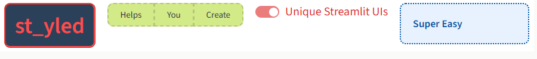

# st_yled - Advanced Streamlit Styling

Streamlit is great - but styling individual elements is a hassle.

**st_yled solves this by providing a simple way for styling Streamlit elements and components**

Transform your Streamlit applications with enhanced elements and comprehensive styling capabilities. st_yled provides everything you need to create beautiful, professional-looking Streamlit apps which match your personal tone or corporate brand.


---

## Key Features

🎨 **CSS Integration** - Load custom CSS files and apply styles seamlessly

🎯 **Global Styling** - Apply consistent styles across all elements

🔧 **Enhanced Elements** - 44+ styled component wrappers with validation

⚡ **st_yled studio** - Use the accompanying app to test your layout styling

---

## Quick Start (5 minutes)

### 0. Check st_yled studio

[**st_yled studio**](https://styled-studio.streamlit.app/) is a free app to test and optimize your Streamlit layouts and UI styling.
Your directly export your layouting into your Streamlit app using st_yled together with the studio app.

Here is the [link to st_yled studio](https://styled-studio.streamlit.app/)

### 1. Install st_yled

```bash
pip install st-styled
```

### 2. Create your first styled app

```python
import streamlit as st
import st_yled

# Initialize styling - set for each app page
st_yled.init()

# Style all buttons globally with a lightblue background
st_yled.set("button", "background_color", "lightblue")

# Use enhanced elements to style the (text) color of a single button
st_yled.button("Styled Button", color="white")

# Or the color of the title
st_yled.title("Welcome!", color="#57cf1cff")
```

### 3. Run your app

```bash
streamlit run app.py
```

That's it! Your Streamlit app now has professional styling with just a few lines of code.
<!--
---

## Featured Examples

### [Business Dashboard](examples/use-cases/business-dashboard.md)
Professional metrics, charts, and KPI displays with cohesive styling themes.

### [Color Theme Showcase](examples/basic-examples/color-themes.md)
Explore different color schemes and theming approaches for your applications.

### [Interactive Form](examples/advanced-examples/responsive-design.md)
Responsive form layouts with styled input elements and validation feedback.

### [Data Visualization](examples/use-cases/data-analysis.md)
Enhanced charts, tables, and data display elements with custom styling. -->


---

## What Makes st_yled Special?

### Simple Yet Powerful
```python
# Initialize styling - set for each app page
st_yled.init()

# Global styling - affect all elements of a type
st_yled.set("button", "background_color", "lightblue")

# Individual styling - customize specific elements
st_yled.button("Click me!", background_color="#4ecdc4")
```

### st_yled studio: Try and optimize your Streamlit styling

st_yled studio is an open and free webapp for you to try, configure and optimize theming and styling of you Streamlit app.

Here is the [link to st_yled studio](https://styled-studio.streamlit.app/)

Once optimized, you can export your app layout and save in the `.streamlit` folder of your app. st_yled will automatically make use of your custom layout.

### Comprehensive Validation
st_yled validates all CSS properties and provides helpful error messages, preventing common styling mistakes and ensuring your app looks great across different browsers.

### Production Ready
Built with enterprise applications in mind, st_yled includes performance optimizations, error handling, and extensive testing to ensure reliability in production environments.

---

## Get Started

Ready to transform your Streamlit apps? Choose your learning path:

- **New to st_yled?** → [Installation Guide](getting-started/installation.md)
- **Want to see examples?** → [Examples Gallery](examples/index.md)
- **Need specific elements?** → [Component Reference](elements/index.md)
- **Advanced usage?** → [API Documentation](api/index.md)

---

## Project Stats

- **44+ Enhanced Streamlit Elements** with styling capabilities
- **Comprehensive Validation** for 50+ CSS properties
- **Production Tested** in enterprise applications
- **Active Development** with regular updates and new features
- **MIT Licensed** for commercial and open source use


---

## Documentation Sections

### [Getting Started](getting-started/installation.md)
Step-by-step tutorials for new users, from installation to your first styled app.

### [Elements](elements/index.md)
Complete reference for all 44+ stylable elements with examples and options.

### [Examples](examples/index.md)
Ready-to-run example applications organized by difficulty and use case.

### [API Reference](api/index.md)
Detailed documentation for all functions, parameters, and configuration options.

<br>
<br>

st_yled with ❤️ from [EVOBYTE](https://www.evo-byte.com)
